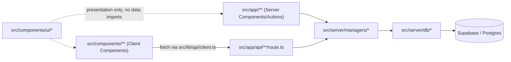

# Architecture Spine — Brújula backend/GUI decoupling

## Design Paradigm

**Layered architecture**, three layers under a new `src/server/` tree, one-directional dependency:

`src/app/**` (pages) + `src/components/**` (UI) → `src/server/managers/*` → `src/server/db/*` → Supabase (today) / Postgres (future)

- **`db`** — data access only. Wraps `supabase.from()`/`supabase.rpc()` calls with typed signatures. The ~35 existing Postgres RPCs count as *part of this layer* (their logic runs RLS-scoped inside Postgres) — not ported to TypeScript.
- **`managers`** — business logic and orchestration. Calls `db` only.
- **API surface** — the managers layer exposed to callers, in-process (Server Components/Actions) or over HTTP (`app/api/**`, Client Components, future external clients).

## Invariants & Rules



### AD-1 — Three-layer separation, one-directional dependency
- **Binds:** all application code under `src/app/**`, `src/components/**`, `src/server/**`.
- **Prevents:** UI code reaching around the API to touch Supabase/Postgres directly; managers reaching past `db` into the database client.
- **Rule:** `src/server/db/*` is the **only** code permitted to import a Supabase/Postgres client. `src/server/managers/*` may only import from `src/server/db/*`. `src/app/**` and `src/components/**` may only import from `src/server/managers/*` (in-process) or call `src/app/api/**` over HTTP (via `src/lib/api/client.ts`) — never `@/lib/supabase/*` directly.

### AD-2 — DB-access layer is the Supabase-removal seam `[ADOPTED]`
- **Binds:** `src/server/db/*`.
- **Prevents:** Supabase-specific types/calls leaking into `managers`, the API layer, or GUI code, which would make a future backend swap touch the whole codebase instead of one layer.
- **Rule:** Every `db/*.ts` file exports typed functions with no Supabase-shaped types in their signatures (plain TS types/interfaces only). Existing RPCs (`get_request_competency_comparison`, `close_cycle_request`, `submit_feedback_response`, etc., ~35 total) are wrapped here as-is; their internal logic is not rewritten. This is the single place a future direct-Postgres client swap touches.

### AD-3 — Managers own business logic; enforced by import boundary, not by HTTP `[ADOPTED]`
- **Binds:** `src/server/managers/*`, `src/app/**`, `src/components/**`.
- **Prevents:** a page or component reaching around the layering by importing `@/lib/supabase/*` **or** `@/server/db/*` directly (both are the failure mode this initiative exists to stop — a Server Action calling `db/*` straight past a manager is just as much a violation as one calling Supabase directly).
- **Rule:** An ESLint `no-restricted-imports` rule forbids `src/app/**` and `src/components/**` from importing `@/lib/supabase/*` **or** `@/server/db/*`. Defense in depth: every file in `db/*` and `managers/*` opens with `import "server-only"`, so an accidental client-bundle import fails the build, not just lint. Managers call `db/*` only, own orchestration/business logic (e.g. FormData→typed-answer reshaping), and contain no `redirect()`/`revalidatePath()` (Next.js-specific, belongs one layer up). Eight managers, one per domain: `cyclesManager`, `feedbackManager`, `responderManager`, `reportGroupsManager`, `membersManager`, `adminManager`, `authManager`, `aiInterpretationManager`.
- **`feedback_requests` shared-table ownership:** `cyclesManager` and `feedbackManager` both read the `feedback_requests` table (discriminated by `request_type`) via `db/cycles.ts`/`db/feedback.ts`, but write/lifecycle ownership follows the RPC naming split that already exists in Postgres — `cyclesManager` calls only cycle-specific lifecycle RPCs (`create_feedback_cycle`, `close_cycle_request`, `organize_cycle_evaluators`); `feedbackManager` calls only ad-hoc-specific ones (`create_ad_hoc_feedback_request*`, `close_ad_hoc_feedback_request`). Neither re-implements the other's lifecycle RPC call; a shared read-only helper (e.g. status/type lookup) lives once, in whichever `db/*` file needs it first, and the other imports it.
- **`aiInterpretationManager` is a split, not a verbatim move:** `src/lib/aiInterpretation.ts` as written takes a `SupabaseClient` param and calls `.rpc()` directly, which itself violates this layering. Its RPC calls (fetching comparison/saboteador data, `save_ai_interpretation`, `save_report_group_interpretation`) move to a new `db/aiInterpretations.ts`; only prompt-building, the Anthropic API call, and orchestration stay in `aiInterpretationManager`.

### AD-4 — Managers exposed two ways: in-process and HTTP `[ADOPTED]`
- **Binds:** `src/app/**` (Server Components/Actions), `src/components/**` (Client Components), `src/app/api/**/route.ts`.
- **Prevents:** pointless self-`fetch()` round trips from Server Components to the app's own API (same serverless function boundary on Vercel — adds latency, not isolation), and Client Components being unable to reach data at all.
- **Rule:** Server Components and Server Actions call manager functions as in-process TypeScript calls (`'use server'` action files become one-line delegates). Client Components and any non-browser client call `src/app/api/**/route.ts` Route Handlers over HTTP via `src/lib/api/client.ts` (same-origin fetch, local `useState` loading/error, no state-management library). Both paths call the *same* manager functions — managers are the single source of truth.

### AD-5 — Own API-key/token auth scheme, issued alongside (not replacing) the Supabase session `[ADOPTED]`
- **Binds:** `src/app/api/**/route.ts`, `src/server/shared/auth.ts`, the login flow.
- **Prevents:** coupling the new API boundary's identity model to Supabase Auth, which blocks the planned future Supabase removal; also prevents silently breaking the RLS policies that `SECURITY DEFINER` RPCs depend on (see AD-6).
- **Rule:** Route Handlers authenticate the *GUI* via a new `requireApiToken()`, never by reading the Supabase session cookie directly. Login now issues **two** distinct credentials: the existing Supabase session cookie (unchanged, consumed only by `db/*` to satisfy RLS) and the new first-party token (consumed only by the API layer). These are deliberately decoupled, not one replacing the other — the dual-issuance *is* the Supabase-removal seam: when Supabase is actually removed, only the Supabase-session half goes away. `[ASSUMPTION]` The new token is carried as a separate httpOnly + Secure + SameSite=Lax cookie (not a browser-stored bearer token), **plus a lightweight anti-CSRF check on mutating requests** (e.g. a required custom header `requireApiToken()` verifies is present — SameSite=Lax alone is not sufficient current practice for state-changing endpoints). Exact issuance/refresh/rotation flow and the CSRF-header mechanism are deferred to the scaffolding epic.

### AD-6 — RLS remains the authorization backstop during transition `[ADOPTED]`
- **Binds:** `src/server/db/*`, all migrated domains.
- **Prevents:** shipping a new, unaudited, hand-rolled authorization layer in application code at the same time as a new auth-token scheme, on a production app with zero test coverage — the highest-risk combination available.
- **Rule:** `db/*` continues building its Supabase client from the real Supabase session cookie (per AD-5, still issued at login) so existing RLS policies and `SECURITY DEFINER` RPCs that hand-check `auth.uid()` (e.g. `get_responder_context`, `submit_feedback_response`) keep enforcing authorization even as `requireApiToken()` changes how the *GUI* proves identity to the *API*. Replacing RLS with explicit application-level authorization checks is an explicit, separate, later epic — done only once Supabase itself is actually being removed, never bundled into a domain migration.
- **Known discrepancy to verify during the POC:** `src/lib/supabase/server.ts` has a comment claiming session refresh is handled by "the middleware," but no `middleware.ts` exists anywhere in the repo today. If Supabase session refresh isn't actually happening anywhere, this AD's whole safety net (RLS via the session cookie) degrades silently for long-lived sessions — check this first, before the report-groups POC is considered proven.

### AD-7 — Invitee-token flows are a separate, unauthenticated credential, not `requireApiToken()` `[ADOPTED]`
- **Binds:** `src/app/responder/[token]`, `src/app/invitacion/[token]`, `feedback-requests/[id]/submit`.
- **Prevents:** gating the anonymous evaluator flow behind login-based auth it structurally cannot have — these invitees never sign in; the single-use invitation token *is* their only credential (existing product design, unchanged).
- **Rule:** Responder/invitee-facing routes validate the existing single-use invitation token (via `db/responder.ts` → `get_invite_details`/`get_responder_context`) instead of `requireApiToken()`. `requireApiToken()` guards only routes reached by an authenticated app user (member/supervisor/admin).

### AD-8 — Domain migration order is risk-ascending, fixed `[ADOPTED]`
- **Binds:** all six domain-migration epics.
- **Prevents:** migrating the anonymity-critical or externally-facing flows before the pattern (`db`/`manager`/route-handler/lint-boundary/token-auth) has been proven on a low-stakes domain.
- **Rule:** Migration order: (1) report groups — POC, (2) admin/members + auth, (3) cycles, (4) feedback, (5) responder/invitation — last, (6) read-only reports. Per-domain UI redesign work is sequenced *after* that domain's backend migration lands, never before. Global/additive redesign work (tokens, fonts, palette, shared chrome) may start anytime in parallel.

### AD-9 — Minimum viable test safety net `[ADOPTED]`
- **Binds:** every domain-migration epic.
- **Prevents:** a broken migration reaching production users undetected, given zero existing test coverage.
- **Rule:** Vitest (pinned `^5.0`, Node ≥22.12 already satisfied by the repo's installed Node v22.22.1) runs against a local `supabase start` instance seeded via the existing `scripts/seed-*.mjs` scripts — never production. Each domain migration follows **characterization testing**: tests are written against the domain's *current*, pre-refactor implementation first, capturing its actual behavior as a recorded baseline (not aspirational behavior) — covering auth-boundary rejection, anonymity-threshold enforcement, and that domain's most state-changing operation. The new path is then verified against that same recorded baseline at each subsequent stage of the migration (after scaffolding, after the Server Action/page refactor, and immediately before the feature flag flips) — a running check, not a single golden-output comparison only at the end. **Scope note:** Vitest targets `db/`, `managers/`, and `api/route.ts` layers only — it does not support testing async Server Components, so Server Component rendering correctness stays manually/QA-checklist verified, not unit-tested.

### AD-10 — Rollback safety via per-domain feature flags `[ADOPTED]`
- **Binds:** every domain-migration epic.
- **Prevents:** an irreversible, all-at-once production cutover with no staging environment and no CI to catch regressions first; also prevents two domains implementing the flag check in different layers such that "old path" and "new path" aren't swapped consistently.
- **Rule:** Old and new code paths coexist per domain behind a simple env flag (e.g. `USE_NEW_API_CYCLES`, default off), **checked in exactly one place: the thin caller** (the Server Action delegate or Route Handler), never inside a manager — managers stay flag-agnostic. One domain, one flag, one deploy at a time — never batched. Manual QA against a seeded scratch DB precedes every flip. The old path is deleted only after the new path survives one full production cycle.

### AD-11 — Shared UI primitives are presentation-only `[ADOPTED]`
- **Binds:** `src/components/ui/*`.
- **Prevents:** the future design-token/component system (DESIGN.md/EXPERIENCE.md work) becoming entangled with data fetching.
- **Rule:** `src/components/ui/*` holds only visual primitives (Button, Card, Input, Badge, tokens). It never imports `@/lib/api/*`, `@/server/managers/*`, or `@/lib/supabase/*`.

### AD-12 — Infrastructure-service integrations get their own `infra/` layer `[ADOPTED]`
- **Binds:** `src/server/infra/*`, `src/server/managers/*`, `eslint.config.mjs`.
- **Prevents:** a third-party API integration with no Supabase client and no RLS/authorization dimension (so it fits neither `db/*`'s nor `managers/*`'s reason for existing) being forced into one of those two layers anyway, or — the other failure mode — being called straight from a page/Server Action with no layer at all, the same "reach around the seam" problem AD-1/AD-3 already forbid for Supabase.
- **Rule:** Story 7.6 introduced `src/server/infra/email.ts`, the first file in a new `src/server/infra/*` layer, for integrations that construct a third-party SDK client (Resend, and any future infra integration of the same shape) rather than a Supabase client. `infra/*` is called only from a manager, never from a page, Route Handler, or `db/*` file — mirroring AD-1's shape one layer over: `db/*` is the only code allowed to import `@/lib/supabase/*`/`@supabase/supabase-js`; `infra/*` is the only code allowed to import an infrastructure-service SDK (`resend`, etc.). `src/app/**`/`src/components/**` are forbidden from importing `@/server/infra/*` directly, the same `no-restricted-imports` shape as the existing `@/server/db/*` restriction. An `infra/*` file never constructs a Supabase client and never reads/writes application data directly — a manager first reads whatever it needs via `db/*`, then hands `infra/*` only the already-resolved primitives (a recipient address, a rendered subject/body) it needs to perform the side effect. Same graceful-degradation contract as `aiInterpretationManager`'s `ANTHROPIC_API_KEY` handling: a missing service credential (e.g. `RESEND_API_KEY`) makes the integration a silent no-op, never a thrown error that breaks the calling manager's flow.

## Consistency Conventions

| Concern | Convention |
| --- | --- |
| API error shape | `[ASSUMPTION]` JSON body `{ error: { code: string, message: string } }`, HTTP status conveys the class (401/403 auth, 404 not found, 422 validation, 500 unexpected). |
| File naming | One file per domain per layer: `db/<domain>.ts`, `managers/<domain>Manager.ts`, `api/<domain>/route.ts` (kebab-case URL segments, camelCase domain in file names). |
| Feature flags | `USE_NEW_API_<DOMAIN>` env vars, default `false`, read server-side only, checked at exactly the caller (AD-10) — never inside a manager. |
| Auth — authenticated app users | `requireApiToken()` in `src/server/shared/auth.ts` is the single place Route Handlers check identity for authenticated-user routes; managers never read cookies/headers themselves — identity is passed in as a parameter. |
| Auth — anonymous invitees | Single-use invitation token validated via `db/responder.ts` (AD-7) — a separate mechanism, never `requireApiToken()`. |
| State mutation | Writes only through a manager function; no direct `supabase.rpc()`/`.from().insert()` outside `db/*`, and no `db/*` call from `src/app/**`/`src/components/**` bypassing a manager (AD-3). |
| DTO shape | Manager return types use camelCase fields, `null` (never `undefined`) for absent values, ISO-8601 strings for all timestamps. |

## Stack

| Name | Version |
| --- | --- |
| Next.js | 16.3.1 (App Router) |
| React | 19.2.8 |
| @supabase/ssr | ^0.12.4 |
| @supabase/supabase-js | ^2.112.3 |
| TypeScript | ^5 |
| Tailwind CSS | v4 |
| ESLint | ^9 + eslint-config-next 16.3.1 |
| Vitest | `^5.0` — new addition, no test runner exists today. Scoped to `db`/`managers`/`api` layers only (AD-8); does not support async Server Component testing. |

## Structural Seed

```text
src/
  server/
    db/
      client.ts          # re-exports createClient() from lib/supabase/server, unchanged (still Supabase-session-based, per AD-6)
      cycles.ts
      feedback.ts
      responder.ts        # invitee-token flow: get_invite_details, get_responder_context, submit_feedback_response
      reportGroups.ts
      members.ts
      admin.ts
      aiInterpretations.ts  # split out of src/lib/aiInterpretation.ts's RPC calls, per AD-3
    managers/
      cyclesManager.ts
      feedbackManager.ts
      responderManager.ts   # invitee-token flow orchestration, distinct auth model (AD-7)
      reportGroupsManager.ts
      membersManager.ts
      adminManager.ts
      authManager.ts         # also issues the new first-party token at login, per AD-5
      aiInterpretationManager.ts  # prompt-building + Anthropic call only, per AD-3
    shared/
      errors.ts           # normalized ApiError type, error-envelope mapping
      auth.ts              # requireApiToken() (authenticated users) -- invitee routes use db/responder.ts instead, per AD-7
  app/
    api/
      cycles/route.ts
      cycles/[id]/route.ts
      cycles/[id]/close/route.ts
      feedback-requests/route.ts
      feedback-requests/[id]/route.ts
      feedback-requests/[id]/submit/route.ts
      report-groups/route.ts
      members/route.ts
      admin/companies/route.ts
      ai-interpretations/route.ts
    actions/                # existing 6 files become thin manager-delegates
  components/
    ui/                    # new shared presentation primitives
  lib/
    api/
      client.ts             # browser-side fetch wrapper (apiFetch<T>)
```

## Deferred

- **Full RLS → application-level authorization rewrite** — depends on the actual Supabase-removal decision timeline; not part of this pass (see AD-6).
- **Direct-Postgres client swap** (`pg`/`postgres.js` replacing `@supabase/supabase-js` inside `db/*`) — deferred until Supabase removal is scheduled; the seam (AD-2) is what makes it contained when it happens.
- **Token issuance/refresh/rotation implementation detail** — deferred to the scaffolding/POC epic (see AD-5's `[ASSUMPTION]`).
- **API versioning strategy** — not needed yet (single first-party consumer); revisit if/when a genuinely external client is onboarded.
- **Whether a staging environment gets introduced** — current mitigation is per-domain feature flags + local seeded QA (AD-10); revisit if the team's risk tolerance changes.
- **Whether/how to introduce CI** to run the ESLint boundary rule and Vitest suite automatically — today both are local-only (no CI exists anywhere in the repo). Revisit condition: decide before the report-groups POC (first domain migration) is considered done, not later.
- **Exact CSRF-header mechanism and token issuance/refresh/rotation flow** (AD-5) — scoped to the scaffolding epic, once the POC proves the layering pattern.
